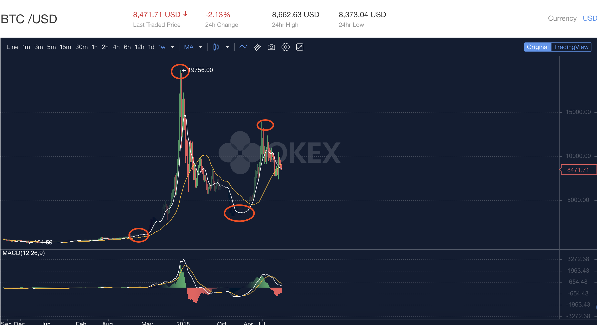

# 定投践行群讲课的思考
## 2019-11-03
### 主动的边界
**《把时间当做朋友》** 书中提到如何管理时间，按照时间分段来控制时间很多时候是无效的。有效的是如何控制我们的注意力。但是这次定投践行群中提到了 **主动边界** 。这个思考方式太牛逼了。我们总是再抱怨有些我们改变不了的事实，比如出生环境、智商、甚至颜值。而忘记改变自己能够改变的事情。或许改变自己能改变的事情不能使自己变成伟人或成功人事，但是那又如何，我们不是变的更好了吗？我们不应该开心吗？（自己要有一种不断提高自己的思想，坚持每天提高一点点，每年成长一点点）

### 自己是傻逼怎么了
李笑来在录音中评论自己刚进入一个新行业或者一个新市场，然后被一群所谓的聪明人(他们也许在那个行业确实比较牛)当成傻逼。李笑来的方式就是私底下啃书本，自己琢磨然后以飞快的方式前进。然而这个时候一群所谓的聪明人还是把李笑来当傻逼，其实这个时候李笑来已经和他们差不多了甚至比他们强了太多。但是这个时候这些鄙视李笑来的人还没有认清事实，还是以以往的观点来给评价李笑来。

### 总结:
1. 刚进入某个自己不了解行业被称为傻逼，我感觉这是再正常不过的事情了。比如高中老师讲课，如果按照上面所谓聪明人的方式定标签，那么在坐的所有学生都是傻逼。但是依然不妨碍几年后学生在认知、财富上领先老师好几条街。
2. 自己称自己傻逼没什么不好。或许是自嘲、或许是一种调侃。我们应该认清一个事实就是，当我们进入一个自己不懂或者不擅长的领域，我们确实是傻逼(这里的傻逼是不懂的意思而不是真傻逼)。这样想的话，其实我们进入一个新行业，我们肯定会做一些错误的事情，然后被老师傅或者行业经验丰富的人成为了傻逼，我感觉他们对自己的评价很中肯。毕竟自己做错了。
3. 傻逼和真傻逼是有区别的。傻逼是当人家认清一个事实后，然后对自己进行改良和不断提高，最终让自己变成所谓的聪明人或者变的不那么傻逼。但是真傻逼就不一样了，他们认不清事实，而且总在言语上说自己很牛逼。这类傻逼最好远离或者尽量少接触。

## 2019-11-09
### 逆火
> “逆火”这个词是李笑来老师在践行群提出的一个概念。我的理解就是指的就是一些人的明明做错了事情但是就是不承认，或者就算口头承认了，但是内心还是拒绝的的这样的一个状态。
思考下自己作为一个程序员有时候也是会发生这样的一个现象。明明事实摆在面前是自己的错误但是还是会找借口来回避问题，而不是真正的从内心接受。虽然我们从小到大都在喊要敢于承认错误是一种美德。

### 关于独立思考
”**独立思考**“从这个字面意思就可以明白，就是自己一个人思考。但是这样真的会有效吗？下面是总结：
1. 独立思考本身是没有问题的，但是如果我们知识或者能力比较匮乏，那么再怎么独立思考估计也是黔驴技穷，想破脑袋也想不出来一个好的方案，即使想出来可能也是闭门造车。
2. **独立思考**的某一方面的事情，你必须再这方面下够足够的功夫，这时候再加上自己思考，才会产生好的点子，这才是真正意义上的独立思考。比如：学生时代让自己独立思考做一个数学题，但是自己本身对一些基本的数学公式都没有好好的理解和钻研。突然老师给你一道题让你用**独立思考**方式去做，那时候即使给你再多的时间你也想不出来，毕竟最基本的数学定律都没有掌握，怎么可能去解出来一个比较高深的难题呢？
3. 都在强调独立思考的同时，我们也应该同时加强对能力加强。这种能力包括某方面的技能，比如我我想对程序进行独立思考，那我需要了解计算机的系统原理，编程语言的语法等等，而且还需要不断的钻研和别人交流，这样才会给独立思考创造更好的条件。
> **你的优秀取决于你在背后所做的功夫的多少。俗话说，台上一分钟，台下十年功。**
### 战胜自己
> **战胜自己一点都不快乐，这就是为什么当我们达成某个目标就再也不会做那件事情了。**

例如：

还记得我们高考完的场景吗？反正我们学校每年高考完都会把所有的卷子给撕毁并且从楼上扔下去，整个学校像下雪一样。 很明显那时候的我们都很厌恶学习，而且是从心里的厌恶。那个时候我们老师的口头语是什么呢？

1. **战胜自己我们才能，你自己就是就是你最大的敌人。战胜自己以后你将无所不能。**
2. 别怕苦现在咬咬牙到大学就好了。
3. 你只管学习，其他事情你就不需要操心了。

本来学习是一件终生学习的事情，却被我们在高中的时候就产生了消极的学习想法。那时候我们才18岁左右，我们的人生刚开始，最可怕的是在我们最好的年纪的产生了这种思想。

我不否认我们学习的过程中会经历一段比较痛苦阶段，但是我们还是要端正态度。**把学习和生活结合在一起，而不是为了学习而学习，这样只会让我们到达某个目标后迅速的放弃。**

”**你只管学习，其他事情你就不需要操心了。**“这句话明显是让我们变成机器一样，让我们填鸭式学习。但首先我们是一个人，我们有自己的思想和情绪，如果为了所谓的高考把自己彻底整疯，那我们宁可当个学渣或者退而求其次做个中等的学生就好。

**关于我本人的看法**：想起来高中时代遇见好几个都是因为学习的压力让自己彻底和生活隔离的人，真的挺可怜的。或许他们背负着什么，但是确实教育和老师的病态手法，没有人去真正的去感受他们内心在做什么，没人去安慰他们内心。同时也给我们自己一些忠告，如果发现我们的思想出现问题，应该及时的减少对你造成影响的事情，必要的时候可以放手，毕竟自己作为一个完整的人才是人的基础。

### 表达的质量

>1. 当别人提出一个观点的时候，自己可以从不同的角度进行阐述。
>2. 不要为了不同而不同，要不就是哗众取宠，失去了真正的意义。
>3. 为了正确的答案而提出不同的看法。
>4. 讨论的目的是为了求真，严谨的过程有时候比结果更重要。

### 收益模型和损失模型

>根据行为经济学研究表明：
>
>1. 人们失去1块钱的痛苦远远大于收益一块钱的快乐。
>2. 人们面对投资的时候总是非理性行为多于理性的行为。

> 以下图表是参考李永乐老师画的图表
>
> 详细可以查看李永乐老师youtube视频，地址为：https://www.youtube.com/watch?v=8Tz1WAp4vRE

|  方案名称  | 收益(+)或者损失(-)以及概率的描述以及组合方案 |
| :--------: | :------------------------------------------: |
| 收益模型-1 |            获得+10000元概率为100%            |
| 收益模型-2 |    获得+20000元概率为50%+获取0元概率为0%     |
| 损失模型-1 |           损失-10000元的概率为100%           |
| 损失模型-2 | 损失-20000元的概率为50%+损失-0元的概率为50%  |

对于**收益模型**，人们更愿意选择**收益模型-1**，反正稳赚不赔何乐而不为。但是对于**损失模型**，人们偏向于选择**损失模型-2**，内心的os：万一我选择损失0元呢？**实际上如果选上损失20000就比较尴尬了。**

>实验表明：
>
>1：对于收益模型人们更偏向于选择更为稳妥的收益方式。
>
>2：对于损失模型人们更愿意去冒险去选择损失模型-2。
>
>**3：人们对损失模型的敏感度往往大于收益模型的敏感度。**

如果从这个角度来讲，就可以阐述，有些人为何买股票总会被牢牢地套死。引用**前锤子科技闯哥**的说法：

>**止损**。

## 2019-11-16

### 投资的思考

下图为Okex交易所按照周为颗粒度的btc走势图。

当小白刚进入投资市场，都会按照小时，日，月为单位来看某个投资标地的走势，然后好从中发现什么。比如上图，很多人会在想要是我在1000美金(第一个红圈)入手，然后19756美金(第二个红圈)的时候卖掉这样该有多好，然后我就可以开着法拉利抱着白富美过上自己想要的生活。或者退而求其次，2019年1月份3000美金(第三个圈)入手，然后2019-07-01的时候以10718美金的价格卖掉也行啊的幻想。

投资理性派分析

> 1. 选择你认为未来可能有无限价值的投资标地。
> 2. 购买你认为有价值的投资标地，并且长期持有。

投资赚钱派分析

> 低价买入，高价卖出。

理性派就不谈了，那么我们剖析一下**投资赚钱派分析**。一眼看上去**投资赚钱派分析**的逻辑上并没有什么毛病。确实如果单纯理想状态下话，这么说确实是一点问题没有。有问题的是，我们如何才能低价买入，并且居然还能在高点卖出(其实很多人不但想在高点卖出，而且还想在最高点卖出，最低点同理)。

所以出现了无数的**证券分析师**来分析股市的走势。其实我听过好几次，说道最后都tm是所谓辩证的看待问题，最后也不会给你一个明确的答案(如果他们能准确的预测到股市的变化，为何要告诉韭菜。那个时候就算预测成功，那么也可能不成功了，是不是很戏剧)。

> 答案很简单，我们无法准确的在最低点购买，并且再最高点卖出。即使有也是极小的概率。

那么我们再分析一下**投资理性派分析**方案，如果你认为是某个标地是有价值的，并且持久的投资，那么你可能会在价格最高的时候入手，但是也有可能在最低的价格时候入手。更为重要的是有以下两点原因：

> 1. 投资市场熊市的周期往往比牛市的时间长很多，那么我们定投的话在熊市买到的投资标地一定高于在牛市时候买到的投资标地。
> 2. 如果你选的投资标地真的有价值的话，那么从总体上看的话，它的走势一定是趋于增长的，虽然中间会有多次波峰或者波谷。

**定投带来的好处**

>1. 当价格波动的时候我们会变的很平静，因为我们的目标是长期，而不是短期的一时得失。
>2. 让我们场外赚钱的能力更加优秀，当然这也是定投的基础，要不哪来的钱来做定投。
>3. 让我们的生活变的更美好了。我们会享受生活的同时合理利用时间提高自己从而加强自己赚钱能力。而不是每时每刻都盯着交易所的价格走势图。

### 选择

> 1. 我们总是对鸡毛蒜皮的事情纠结半天，但是对于相对重要的事情却总视而不见，或者从不做选择，甚至在没有经过慎重思考的情况下直接草率的下了决定。
> 2. 我们选择总是偏向于关注眼前的利益，而不是考虑长久的利益(虽然我们在选择之前总是说要考虑长久的利益，必须放弃眼前的利益，但是实际情况摆到自己面前，自己变成了原始人)。

那我做的事情做个例子：

以前每当我要买一本书的时候，书的价格是200多点，这个时候我就会在为啥这么贵，然后就会放弃。相反，每当Apple出一款新手机的时候，这时候的价格是8600多，将近一万块。但是我缺犹豫的时间很短然后直接买回来，第一时间体验。仔细想一想，读书或者说学习知识是让自己变的更好，从而让自己在以后变的更有价值。

> 很明显以前的我，也只是重视眼前的利益或者快感，而对于以后的成长的却做出了错误的选择，说严重一些是**可悲的选择**，毕竟读书需要经过一段时间或者很长时间才能体现出来的价值。

**训练做选择的能力**

> 1. 当自己做选择的时候，看看对长期是否有利。
> 2. 隐忍短期的诱惑。

### 时间和金钱

 **时间和金钱的共同属性**

> 1. 被消费
> 2. 被用来投资

**钱的消费观念**

大多数人投资为了赚钱，赚到钱后呢，我猜回答应该是这样的，我买去买辆XX豪华轿车，我要去全世界旅游，我要在老家买套房子等等。这么想猛的一看并没有哪里不合适，毕竟钱从股市或者其他投资领域拿出来并且消费才算发挥了钱的作用。但是问题在于：

> 1. 当我们赚了一笔钱以后，特别是投资赚来的钱都认为是白来的一样，导致花钱无节制。
> 2. 没有新的投资方案，造成把拿出来的钱可能都会用于消费，从而让钱失去再生能力。

钱最重要的能力除了消费之外，还有强大的再生能力。所以自己尽量的做到，在合理的消费情况下，还能找到下一个投资标地从而进行投资。投资是一个长期的工作，必须时刻不间断的进行，如果中途放弃，虽然前面的投资已经让自己获利很多，但是后面的生活可能将会越来越狼狈。

注意事项:

> 1. 投资的钱也是自己消耗时间和精力赚取的，并不是自己头脑中想的很容易(其实并不容易，只是自己赚到钱后才感觉到很容易罢了)。
> 2. 投资是一个**以终为始**的行为。必须不断破茧重生进行不断的投资。

### 以终为始

> 人生就像在攀登一座你不知道的高峰，每当自己登上了一个山顶，以为就是最高峰的时候，或许只是下一个山顶的起点。

## 努力和理性

> 很多人喜欢很努力的状态，殊不知，无知的努力会让你变的更傻逼。而自己却没有意识到。

## 2019-11-23

### 鄙视链

日常生活中总会发生这样的情况，当你遇到一个问题想要问一个相关行业的人时候，比如他叫小黑。自己和小黑讨论问题的时候，总有有某些理念相冲突，这时候小黑总会说：**我就是在这个行业干的我还不知道吗？**来证明自己懂的比你多。这种人无疑是最傻逼的，从**解决问题角度**小黑并没有给你一个完整逻辑的说服方案，从**情感角度**感觉小黑就是一个傻逼对自己行业一点都不了解的傻逼。

我个人理解如下：

>1. 在某个行业的工作年限只是你成为专家的**必要条件**，而不是**充要条件**。
>2. 要想成为某个行业专家不但需要1w小时作为基础，更重要的**是需要不断进行思考和深耕**。
>3. 讨论的目的是为了**求真**，而不是挣个面红耳塞，谁对谁错。

## 少年不努力，老大徒伤悲

>1. 后悔没有任何意义，唯一能做的就是坚持做现在自己认为是对的事情。
>2. 有时候自己会感觉错过了某个发展的最好机会，然后不再去了解这个领域，其实是给自己一个借口，不想继续努力的借口。很多时候认识到自己的不足然后开始改进其实并不晚，或者说至少自己提高了。否则5年过后自己还是会后悔。终生的后悔。
>3. 不要让自己做后悔的事情。自己有梦想或者愿景，那么就去做，不折不扣的去做。先动起来别在乎结果，重要的是过程。**Just do it！**

### 犯错

一个大道理人人都懂，但是结果呢。自己还是不断的犯错，而且是重复的犯错，其中有一些是比较是自己反复后悔的事情，但是自己依然做了。

## 2019-11-30

### 资本

> 资本本无对错，它只会流向它该在的地方。

成年的人的世界里，**有钱不一定淡定，但是没有钱一定不淡定**。以前年轻时候的自己总想工资高点然后就以为自己总有一天会慢慢的变富直到有一天或许能实现**阶层**的跨越。实际情况是，随着你的工资慢慢的提高，你的年龄和开销也在悄然声息的增加(悄然声息是比较委婉的说法，准确的说是肉眼可见的增加)。然后这个时候人们开始呼**"中年危机"**来了。下面来总结下靠工资来**实现跨阶层**或者说让自己提前**FIRE**是多么的不靠谱。

> 1. 首先我们的收入和自身能力都会遵循**边际收益（Marginal Revenue）**理论。ps:有人说我会不断提高自己能力,让自己再次实现自身的突破，这句话理论上没有毛病，但是依然符合**边际收益**曲线。举例：高中你从0分考到60分会比较容易，但是60分-80分会更难，以此类推99分-100分那么将会难上加难说不定还需要点运气成分。当然一切都是以**平凡的我**来举例，如果你和牛顿一样厉害当我没说。
> 2. 工作的本质就是出售自己的时间和精力然后让自己获利，本身并没有**复利**的概念。
> 3. 支出会越来越大，属于自己的时间越来越少。
> 4. 自身的身体素质在不断下降。

是不是很绝望，我也很绝望。还好我们可以利用资本(rmb)的力量来进行**复利投资**。如果不投资你永远是资本的**孙子**(可能孙子都算不上)，投资或许能让你成为**资本**的**爹**(或许只是是它大爷)。

ps:别说我自己是个程序员了，看看某些明星不也是天天排满班拍戏后续，说白了都是为资本打工，和自己并没有本质的区别。有些明星还因为太努力打工而牺牲了生命。**还是身体第一位，大不了回家卖红薯**。

比如我的偶像**JAY**就很成功，在自己最巅峰的时候从 **[阿尔发音乐](http://wiki.kfd.me/wiki/阿爾發音樂)**离开创建自己公司，然后还进行大量投资，这样收入就不仅仅是**唱片**和**演唱会**了，在家躺着也能有钱赚噢。当然其中的发行唱片是有类似**复利**投资的，因为这个版权也会在**JAY**睡觉的时候也能源源不断的挣钱。

## 2019-12-08

### 这是最好的时代，也是最坏的时代

2019年中国互联网人数得到了8.54亿人，这意味着有一半以上的人都能顺利的接入到互联网中。但是互联网让人们享受娱乐之时，缺也让人与人之间的认知差距在不知不觉中变的越来越大。

1. **互联网让信息的获取变的更加的快捷**

**优点**

>1. 如果你有疑惑或者不明白问题通过google往往能获取到大量的相关资料。
>2. 对于有自学愿望的人来说简直是天堂，他可以廉价的获取到自己想要的学习资料，并且可以再论坛和世界各地的人进行交流，从而发现自己的不足和别人的牛逼之处。
>3. 让自己变的成为一个独立思考和独立学习的人。举个例子：我是一个程序员，当我参加工作的时候总会有各种各样的问题，网上搜竟然都搜不到答案。于是问别人，令人感到惊奇的是自己搜索了半天没有找到答案，别人却用了1分钟的时间查到，那个时候才发现，学会搜索或者说学会提问也是一个很大的学问。

**缺点**

> 以上的所有优点对于没有终生学习的人来说简直噩梦。因为互联网让学习或者说获取知识变的如此的方便和快捷，从而使人们之间的知识和认知差距变的空前的巨大，以至于他们就像处于两个完全不同的世界。举个例子：n=v*t;n代表自己拥有的知识或者认知，v代表获取知识的速度或者获取知识的便捷性，t代表时间。比如互联网之前获取知识的便捷性是1(v=1)，互联网时代获取知识的便捷性为10(v=10),那么都经历一年(t=1)时间，那么会惊人的发现，他们之间差距了10倍。太可怕了。**从这个角度来分析**，**在互联网时代人与人之间的差距变的越来越大才是合乎逻辑的，人与人之间思维差距越来越小才怪**。

2. **注意力的转移**

  其实这个问题归根到底还是信息变的容易获取了。现在的时代有大量的信息会呈现在你的面前，但不幸的是其中无用的信息更多。

优点

> 能够让自己在第一时间获取到自己所关注事件的发展动向。

缺点

> 1. 信息太多导致自己的注意力频繁的发送转移，以至于没有办法**深度**的去完成某件事情。
> 2. 信息太多造成了让自己失去了判断能力变的不理智，不冷静。
> 3. 内心浮躁的一批，无法耐心的干完任何一件事情。

总结：

>1. 让自己头脑中**种下终生学习**的思想，然后通过互联网**不断的搜寻**和交流，进而不断提升自己。
>2. 人最宝贵的就是**健康的身体**和**注意力**，不要把自己自己的注意力浪费在大量无效信息中。(如果自己的注意力总是放在毫无价值的地方，那真的是浪费生命啊，经常这么干的人心该有多大)
>3. **静下心来通过不断的学习和探索，让自慢慢的变成变强，慢慢的变富(不单单指的是钱，还有自己的思想噢^_^)**。

## 2019-12-22

### 幸存者偏差

> 拿着火把穿过炸药厂，即使没被炸死，但仍是傻瓜，虽然是运气好的傻瓜。

这时候拿着火把的出来以后会以为拿火把和炸药厂爆炸直接并没有因果关系。但实际上只是这个傻瓜运气好而已。

自己常常也会犯这样的错误，比如下面的几种方式。

1. 根据以往的经验来判断。

   > 某件事前1000天的历史不会告诉你第1001天任何信息。---《黑天鹅》

   《黑天鹅》中举了这样一个例子，你养了一只火鸡，然后每天都会喂养它，连续喂养了1000天，直到圣诞节前夕。这时候火鸡会以为第10001天依然会有美好的食物来喂养自己，殊不知喂养自己的那只手就是拧断自己脖子的那只手。

   如果自己总是从过去以往的经验判断事情，而不是站在更高的观察点来观察事物。那么一旦发生“黑天鹅”事件，那么我们将会受到严重的影响。

   从火鸡的角度分析，火鸡只会根据以往的喂食的经验来判断自己明天还会有食物吃。但是从人的角度分析，自己喂养火鸡只不过是让它长大，然后到合适的时间把它给宰了。 

2. 逻辑不清晰

   > 1. 如果你告诉别人成功的秘诀决不在于技能，他们会以为你说成功不是靠技能而是靠运气。
   > 2. 无证明表明母乳的优势与证明母乳无优势。
   > 3. 自己看到的天鹅都是白色的，就认为所有的天鹅都是白色的。

遇到这种逻辑的问题需要反向思维，比如：我看到过黑天鹅，那么我肯定的说天下的天鹅不一定都是白色的。我看到某个人偷窃，说明这个人一定是罪犯，等等。

如果遇到你自己认为的因果关系，不妨问自己几个问题(定投践行群，李晓燕老师分享的)：

1. **是这个原因造成的吗？**
2. **这个原因是最主要的原因吗？**
3. **这个原因是唯一的原因吗？**
4. **还有哪些可能的原因吗？**

## 成年人的经济来源

作为第一批90后，马上就要30岁了，没有结婚，没有钱，感觉自己内心慌的一批。

作为大多数普通人来说收入的主要方式或者说唯一的方式就是work(用自己的时间来换取金钱)。随着自己年纪的增加，结婚生孩子，给父母必要的生活费，房贷，种种压力接踵而至。这个情况下让很多人开始变得“沉稳”起来，也就是说不敢动，他们无非是想老老实实工作，尽量让自己的生活变得稳定些。然而事实却总是相反，你越想稳定的生活，生活却越来越动荡。那么来分析下内心只想有份安稳的工作，而失去诗和远方的成年人是多么的无助，但是没有办法，生活不会因为你可怜弱小而眷顾你。**This is life**。下面为依赖工作作为唯一收入的分析：

1. 只依赖工作为自己提供资金来源，那么自己将会无比的依赖这笔自己，这就会让自己失去谈判的余地甚至是尊严。
2. 没有对风险的容错能力。一旦自己失去这份工作，那么自己的生活将彻底的崩溃。不要以为不可能，随着你安稳工作的时间越长(前提是自己能力没有和时间成正比例的情况下)，这种风险出现后，你的生活影响会越来越大（这种情况也可以成为黑天鹅）。

**给自己的建议**：

1. 认清社会的本质，要以**丛林法则**来思考问题，自己的弱小和可怜不会取得幸运女神的眷顾。
2. 多思考一下自身，自身的能力过硬才是硬道理。
3. 努力的实现理财计划，花钱不是目的，尤其自己现在正好处于事业上升阶段的时候，用钱来赚取更多的钱无疑是最有效而且最可靠的方法，而靠996取得的钱，无非是获取了钱，自己失去了时间。
4. 回想自己从毕业到现在无效花费，实在触目惊心。因为自己在最好的时期，却从来没有认真反思过这种对自己未来不负责的行为。这种行为会让自己永远这么穷下去，直到自己的身体已经没有能力来赚取。

## 日常学习

从小学到大学包括到现在自己一直处于一个被动学习的模式。有一段自己的成绩还算可以，当然也可能是我上的学校比较一般，周围的人能力也不是很强。但是其中我发现自己的一个问题，那就是我只是比别人多努力了一点点也就是用时间来换取成绩，这种方式是建立在别人不学习，我自己偷偷回家背诵单词，从而让自己成绩表现的更优秀一点。当然这个默默自己下功夫肯定是基础的基础，没有这个其他学习理论都是白扯，但是我忽略了一个更重要的问题，或者说我已经完成了学习的初级阶段，此时我还需要达到上更上一层楼的时候，我并没有去认真思考，或者说从未认真思考过，如何能更高效更合理。这样导致自己还是只掌握了用时间来换取更好的学习成绩，而不是从学习方法上提高自己，换句话说除了用足够多的时间让自己变的更优秀以外，似乎自己并没有探索出来其他的学习模式。

通过听**定投践行群**里面的**刘晓艳**老师讲课感觉如下观点挺好的(其中也有自己的观点)。

1. 学习的过程中优先做最重要的事情。有可能重要的事情可能进度很慢，但是进度慢也比做不重要的事情做的快做得好更重要。
2. 尝试让自己放松下来，而不是日常生活都在一个紧绷的状态下。给自己留有独立空闲的时间。
3. 读书要读反脆弱型的书籍，比如长销书。而不是读一些所谓排行热榜的书籍。
4. 多读英文书籍，英文真的是可以让自己增加另一个领域的极好的方法(虽然现在我还没有真正体会到，但是已经开始体会到)。
5. 试着用英文方式去搜Google。
6. 完美主义是有很大缺陷的。做事情最重要的是先进入(dive)到具体的事情中，因为做自己不熟悉的领域刚开始做的事情一定会是不完美的，此时完成比完美更重要。先完成然后再不断的进行打磨升级，最后让自己做的事情趋向于完美。
7. **要抓住一件事的重点。比如某本书写的相当的无聊和晦涩，但是非常有用**。这时候应该是努力去读它，而不是抱怨写书的人写的烂。因为不读的话可是自己的损失啊。

## 有效沟通

生活中常常见到这种情况，两个人或者多个人人本来是讨论一个明确的工作或者生活问题，然后慢慢变成攻守转换，最后还有可能变成人生攻击。这样的事情屡见不鲜，我小时候就经常看到这个情况两个大人为了为了一件事情争的面红脖子粗，但是此刻他们不但忘记最初所讨论的问题，而且还也不听对方的观点，直接升级到不是你输就是我赢的层面上了。

以下是有效表达常见的方式，也是我努力要求自己这么做的。

1. 学会提出问题。
2. 说服他人的时候必须尊重对方，如果不尊重对方，有可能你讲的再好或者逻辑再严谨，这时候依然会有很差的效果。
3. 证明他人的错误也不能正确自己的观点是正确的。
4. 有效沟通的目的是交流思想不是为了输赢。沟通的时候需要接受有不同的意见。

和观众沟通的时候，观众究竟想要什么。引用李笑来老师观点：

> 1. 重要的。
> 2. 复杂的。
> 3. 未知的。

## 2019-12-29

最近开始读《黑天鹅》这本书，不得不承认自己的无知，我也知道自己就是一个普通人(至少现在是)。感觉能让自己少走弯路或者让自己变牛的方式只有吸取世界上各界牛人的思想，让他们的精华变成自己的东西。这是目前我唯一变强的途径，这是因为我还没有足够的实力或者我的工作不适合或者我还没主动的进行社会性实验。

以下引用来自《黑天鹅》这本书，都是对自己感触比较深的句子，或者当时自己的思考。

> 1. 在现实的世界里，重要的东西往往是乏味无情的。
> 2. 现实世界中很多事件都是非线性的。比如学习、思考、财富值等这类问题。学习可能你学习了很长时间但是你的成绩不会提升而且还有可能下降。思考也是，有可能一个问题你瞬间明白了，有可能一个问题，你思考了一年半载依然不会有什么好的解决方案。财富值就不用说了，巴菲特的财富值**占全世界的万分之七**(我看到这个数据以后反正是震惊的一批，或者你可以拿马云的财富值和中国的一个内地省份的GDP做对比，比如山西)。
> 3. 投资不能把赚大钱的希望放在投资上，重要的是场外赚钱的能力，而获得巨大财富只是顺其自然的事情。
> 4. 不幸的是你赚了1000万美元，然后损失900万美元。这情形比没有赚到一分钱还要糟！其实自己还是赚到了100万美元的。(人厌恶损失，喜欢趋利避害。而且特别在乎短期的利益，而没有进行长期的打算和思考)
> 5. 黑天鹅事件具有非对称性，要么好要么坏，所以不要把事情集中到一个事件上去。

## 2019-12-30

**来自《黑天鹅》中经典句子的摘抄和思考。**

> 1. 沉默的代价。举例：有一批航海的舰队进行探险，但是航海的过程中有很多船只遭遇了不测。当一部分船只安全回到国内后，国内统计学家开始统计当时**祈祷**和**存活**之间是否有因果关系，统计结果表明发生海难期间**祈祷的人存活比例比较高**，从而认定**祈祷**对自己有保护作用。该统计的方法缺点在于，祈祷的人也可能死去了，这样无法获取他们的证言。这个可以再次延伸，人们都爱采访**成功人士**，认为成功的人有比较好的特质比如：**勇敢、果断、精力充沛等**。但是**失败者**难道没有这些所谓成功的**特质**吗？这或许只是因为没有观众喜欢看一个**失败者**逼逼叨叨吧。
> 2. 想要理解成功并且分析其原因，我们需要了解失败的特点。（避免掉错误的方式，或许可能会成功）
> 3. **极端斯坦**的世界波动性特别大。当我们想要进入**极端斯坦**的世界时，最好有**平均斯坦**做基础保底。至少**极端斯坦发生了本来该发生事缺不发生或者本来不该发生的事却发生了的时候**，自己依然能够承受的起（感悟）。
> 4. 人最重要的是思想要突破条条框框。

## 2020-01-01

题外话：

新年的第一天给了自己一个耳光，关于在对某个人的判断上。这次事件发生在mixin上，其中一个老哥，我经常和他一起讨论关于投资方面的事情。但是突然某一天我觉得人家很low，觉得不需要和人家进行交流。但是新年元旦的这天这个老哥发给我8.88box。此时我又感觉人家很靠谱（这或许就是**人性**中**趋利避害**的再次体现吧）。但是当你再次和人家交流的时候你会发现人家懂的好多东西比自己多好多。自己贴的标签竟然是完全错的（或许自己认为自己看到的就是全部吧）。

结论：

千万别随便给一个人贴标签，因为你感觉你了解人家全部，但只是你认为你了解人家的全部，其实并不是。所有的一切都是假象，都是自己幻想出来的或者都是自己的一厢情愿。

**来自《黑天鹅》中经典句子的摘抄和日常思考。**

> 1. 如果你是一个钟表修炼匠、脑外科医生或者棋手，那么注意力是一个好的品质。但对待不确定性问题时，你最不需要做的就是集中注意力（比如投资领域）。**太过于集中会让你受骗，它会演变成预测问题。**
>
> 2. 思考下如果自己的世界突然出现黑天鹅事件，那么自己应该怎么做呢？比较自己家里2006年的事件，就是彻头彻尾的黑天鹅事件。那个事件彻底改变了自己和自己的家庭。
>
> 3. **我们的知识在增长，我们的疑惑、无知和自负同时也在增长。**
>
> 4. 发生在别人身上的黑天鹅事件，为何自己从来不思考这样的事件如果发生在自己身上会如何。或许自己都在认为不可能发生在自己身上吧。但是发生在自己身上也才能说明事件符合黑天鹅性。
>
> 5. 观察和记录当下目前专家对未来的预测，然后经过多年后回过头来在看，然后比较现在的当下和以前的当下专家预测的区别和正确性（可能两者之间毛关系都没有）。举个例子：2020-01-01现在大多数人对区块链的认识还都停留在BTC（或者炒币上），并且很大部分人认为区块链是一个骗局。当过4-5年后，我们再对比下。
>
> 6. **显的忙碌能够加强人们对结果与你作用之间的因果关系。**
>
> 7. **现实世界中，大多数人喜欢听故事，而传媒喜欢讲故事。但是这些故事往往会影响自己的判断**。比如刚看到的**马未都**讲的《教你学古董鉴定，学问经验天赋心态》这个视频也就是说道，人们喜欢讲故事从而来迷惑自己对事物的判断。比如：有人来请**马未都**鉴定文物，首先一句话就是这东西是祖上流传下来的。
>
> 8. 信息对只是有害。
>
>    - 得到越来越多的信息，自己会以为无效的信息也是有用的信息。
>    - 最开始得到的信息自己认为有用，并且开始下结论或者定标签。一旦下结论，那么这个结论在后续将会很难改变。
>
>    举例：比如有个实验把某个著名的画故意分10个等级和5个等级的模糊程度。让两组实验者来判断最终画上的图像。最终5个等级的小组猜对的概率明显高于10个等级的小组。

## 2020-01-02

**来自《黑天鹅》中经典句子的摘抄和日常思考。**

> 1. 我们把成功归因于自己的能力，把失败归因于我们控制之外的事物。其中最有代表的事件就是随机性事件。反思，难道自己的成功就没有外部因素吗？自己的能力是成功的主要因素吗？两者哪个是最主要的因素呢？
> 2. **最糟糕的情况比自己预测本身重要的多，尤其当人们不能接受这种糟糕的情况下，这一点尤为的重要。**比如：自己投资的BTC、EOS，如果有一天，它们跌成空气或者它们被黑客全部盗走。这个情况下自己的生活是否有比较大的影响。
> 3. **我们总是以为我们掌握了全部的知识，但是没有认识到我们所嘲笑过去的社会也曾有同样的想法。**

## 2020-01-03

**来自《黑天鹅》中作者锁敬佩的人。**

彭加莱的个人了解。

## 2020-01-04

**来自《黑天鹅》中经典句子的摘抄和日常思考。**

>1. 人总是感觉自己知道很多，但是从来不思考自己不知道的知识。(其实自己知道的和不知道的相比根本不值得一提)
>
>2. 有些事物可能太复杂了，超过了我们的理解能力，我们暂时暂时先接受它们，目的是为了保持思维开放。
>
>   个人思考:当我们接触到一个自己完全不了解的事物，并且这个事物还有一定的复杂度（不复杂的可能经过短时间的思考可能就想通了），我们总是会听取新闻媒体或者其他人的话从而自己也开始确信无疑。这样会让自己思维封闭，从而导致自己错过好多机会。拿btc来说就是个经典的案例。
>
>3. 认知自大程度较低的人不一定是缺乏自信，他可能只是对自己的知识持怀疑态度。我将这种人成为"认知者"，将念念不忘人类认识错误的境界成为"认知斯坦".

## 2020-01-05

**来自定投践行群的收获和个人思考**

1. 不要成为差一点就成功了的可怜人。
2. 当听到李笑来的话当时也非常的认同，为何后续做投资判断的时候还会发生动摇呢(虽然比以前动摇次数少多了)。
3. **相比人类讨厌损失，人们对已有的收益的损失更加的害怕。**举例：比如自己投入btc的时候，突然涨到了某个高位后，第二天又发生了所谓的“暴跌”。这时候自己内心竟然有点担心或者说害怕。但是仔细想想自己可是6800美元买的，现在仅仅是从8000美元跌倒7800美元，自己依然有1000美元的利润诶。为什么自己的反应不是开心而是担心害怕呢？
4. 给自己定一个长期的目标：一定要穿越两次牛熊，自己也感受下作为长期主义者的感觉。^_^
5. **自己总是开心地把自己未来的路给堵死。**举例：1：比如在2017年12月份时候，btc价格是2w美金。自己感觉btc是个骗局，然后自己没有买，这个时候btc开始一路狂跌。这个时候自己觉得很开心，自己终于没有看错，btc确实是一个骗局。但是实际上呢，这只是正常的牛熊周期，后续突破2w美金是迟早的事。只不过那个时候自己就该哭了。2：比如买房，买房为了娶媳妇，但是实际问题是这可是在自己最黄金的时代把自己抵押给了银行，这时候的自己或许是自己一生中最有希望突破阶层的时候诶。但是对于买房的人来看，他们并不是这么想，他们总是和不买房的对比，然后觉得自己多么的优越。其实并没有意识到自己已经是百万负翁。
6. **越是早期的错误对自己未来影响就越大。**最简单直接的就是定投和复利效应。
7. **看到一个数字被震惊了，一年涨幅7%，如果连续投资60年，那么翻了57.946倍。平均每年翻一倍。看到这个数字的时候下决心自已一定要做个长期主义者，利用被动的力量。**
8. 一定要用btc投资两个大周期，动作只有**买买买**，除了日常的打赏和发红包，一概不动它。一定要看看**定投和时间积累**的力量。
9. **成长是早期犯错越多越好，而投资确实早期犯错越少越好。好的方法就是默默的观察别人如何投资，看别人损失从而提高自己的决策质量。**
10. 自顾自的好好活下去(只做自己边界之内的事情，少做边界之外的事情)。
11. 所有依赖技能的进步，全部来自于试错。
12. 成年人的世界总是在原地踏步，因为怕试错的思维在作怪。（越不敢试错导致自己越落后，越落后自己越不敢试错，从而形成了恶性循环）
13. 一定要保持勇气，特别是年轻人。勇气是一个人最好的美德。
14. 短期价格趋势就是随机漫步。但是长期价格预测的话，那么几乎任何人都能预测对。比如：我预测3年后的今天btc的价格一定突破2w美金。这个几乎是100%预测正确的。所以从某个角度来分析，**短期预测专家预测不准，长期预测不需要专家自己就可以准确预测**。那么自己为何不做长期主义者做长期的投资者呢？
15. 做自己感兴趣之外的事，比如:1.最简单的是看自己从来不看的视频2.时不时的进入别的圈子，比如和家里的一些小老弟们喝喝酒吹吹牛逼。
16. 只做自己赌得起或自己输的起的游戏。

## 2020-01-08

**来自《黑天鹅》中经典句子的摘抄和日常思考。**

> 1. 大部分”风险管理方法“是有缺陷的，那么你的策略应该是极度保守或极度冒险，而不是一般保守或一般冒险。（没有人确定何为一般保守和一般冒险）
> 2. 不要把钱投入到"中等风险"的投资。(没人能知道)
> 3. **把85%-90%的钱投资极度安全的投资渠道，比如：投国债、直接放支付宝余额宝、甚至直接放银行卡里不动。其他10%-15%应该投入到投机性的赌博中。**个人理解这里的投机性赌博应该是指的是投资风险比较高的方面。只要是用极小的钱来赚更多的钱，即使风险很大，自己也应该去尝试一下。
> 4. **有一点我很难解释，那就是在你只有非常有限的损失的时候，你必须尽可能的主动的出击，大胆的投机，甚至”失去理智“**。个人反思：这句话类似**贝索斯**曾经说过一句话，大意就是：”如果有10%的机会获取100倍的利润，那么我也会尝试10次“。这句话看似很非理性，但是仔细想想完全是处于理性思考后而得出的决策方案！
> 5. **抓住一切机会或者任何像机会的东西，机会很少，比你想象的要少的多**。
> 6. **不要寻找精确和局部的东西，经历让意外进入自己的生活**。比如：自己天天努力的研究投资和代码，也要让自己偶尔聚聚会，打打篮球，**说不定能获取到自己意想不到的的奇迹或者感触**！

个人想法：

在投资之前一定要指定计划，并且记下来，当接下来自己的动作开始偏离或者说开始违背自己原来指定计划的时候，要好好读读和反思当初自己指定的计划。是自己做的计划不好？还是自己自己应该放弃错误的操作，从而**践行**越来的计划。

## 2020-01-09

**来自《黑天鹅》中经典句子的摘抄和日常思考。**

> 1. **我们现在的环境允许小人物在成功的希望前等待时机——活着就有希望。**个人思考：这句话仔细琢磨也是一个长期的思维。自己在生活中还是会不由自主的和其他人比较谁强谁弱（自己是否在持久的进步，自己没有b数吗！）。而这样的比较都只是比较当前的这一刻的情况，而没有进行一个长期的思维。这样只会让我们的心理建设受损。
> 2. **马太效应。**
> 3. 1957年美国最大的500家公司中，只有74家40年后依然位列**标准普尔**500强。只有少数公司因为合并而消失，其余的要么衰败了要么破产了。个人思考：**这表明任何时候黑天鹅都在发生，让一些不知名的小公司进入了标准普尔500强，也让一些大企业从标准普尔500强中淘汰。这代表小人物也有机会成功，成功的王者也有机会衰落。**

## 2020-01-11

> 1. 所谓”识时务者为俊杰“，就是正确的描述，不理解趋势，甚至感受不到趋势的人，只能是平庸之辈。举个李笑来曾经说过的例子：就是改革开放期间，有一些人出国打拼了几十年。因为当时中国经济正处于快速上升的阶段。当出国回来的人发现自己混的还并不比国内的朋友强多少，甚至还不如国内的朋友。于是开始抱怨”命不好“。**自己开车的时候发现旁边的车总是开的很快，于是自己换了车道，结果到最后发现换的这个所谓的快车道还没有以前的快。**总结：如果自己想换一个比现在更快的车道，自己要好好调研，要仔细谨慎的思考换车道的风险。并且提醒自己这样值得吗？实际情况是往往很多时候，不动比动更有效。
> 2. 绝大数的平庸，根源都可以归结为把时间精力浪费在于趋势无关的选择上。仔细思考：现在什么事情是有关趋势的事情。投资，而且是长期投资。即使一个趋势问题。后续会让自己越来越好。
> 3. 为什么有些人总感觉自己没有时间，答案很简单，天天在处理一些鸡毛蒜皮的小事。
> 4. 一切和趋势无关的都是鸡毛蒜皮的小事。
> 5. 过去一定影响未来吗？如果有影响那么影响是多大？那么现在对未来的影响呢？很多时候过去对未来的影响小之又小。

## 2020-01-14

> 1. **钟形曲线**的不确定计量方法忽视**跳跃性**或者**不连续性变化**发生的可能以及影响。
> 2. **我们看待事物不能只看概率的发生大小，更重要的是看它对自己影响的严重程度。**
> 3. 在**平均斯坦**的中并且处理的事物的最大值和平均值相差不大的时候的变量才能使用**钟形曲线**。
> 4. 如果有个理论在特定的场景下适用，那么当我们想要使用这个理论的时候。我们要明白和仔细思考这个理论是否适用于自己想要使用的领域。比如**高斯分布**它只是使用于变量相差不大的**平均斯坦**世界。而像**极端斯坦**则不适用。反思：自己在现实生活中的很多领域也是反了这个错误，没有明白这个理论的具体使用场景，而只是定性的分析，只是感觉他们两个领域很相似。但是实际情况类比的两个领域可能是完全不同的。

## 2020-01-16

1. 比特币的价值和价格本质上取决于一个因素，那就是究竟有多少人在使用比特币。
2. 大数定理。

## 2020-01-22

我们上学的时候总喜欢把没有规律的事件用数学公式来确定。总是习惯或者想法设法的想通过确定的方法来研究社会科学。或许自己忘记了没有规律的事物比有规律的事物多的多。而且不是一个数量级的。最有代表问题就是：世界上什么形状最多，圆形，正方形......

## 2020-01-25

1. 我宁愿追求大体的正确，而不是追求精确而犯错。
2. 我不怎么在意小的失败，而是只会在意终极性的失败。
3. 放弃一份高薪职位带来的回报会超过金钱带给你的效用。这是向命运说“随你怎么样”的第一步。如果你确定了自己的标准，那么你能更好的控制自己的生活。
4. 多数人散步时都会走的很快，他们错误的将散步当作一种锻炼，而不懂得散步时应当保持缓慢的节奏，直至忘记自己是在散步。
5. 一个人在风险投资的同时保持高比例的现金存量。

## 2020-01-26

1. 在自己现实的世界中，自己会随时随地的思考“黑天鹅”事件吗？如果这么想了，自己能做一些行动来对冲它，并且要彻头彻尾的执行。
2. 快速赚取真的是不靠谱吗？我自己所受的教育当中总是以老老实实工作或者说踏实的工作作为判断自己做的事是否靠谱。自己错误的认为 **快速赚取=不劳而获** 或者 **快速赚取=非法获取**等等。从而让自己认为快速赚钱并没有那么踏实。现实中可能真的如此吗？第一点：可能是首先传播这个信念的人思想比较陈旧，他只是把他认同的价值观表达了出来，而且往往这些人没有快速发财的经历，所以他只是表达了他内心世界的价值观罢了。反观世界的一些大公司都是赚钱很快的比如亚马逊，Facebook，难道就说明他们赚的钱不靠谱吗？个人认为快速赚钱和不靠谱之间逻辑关系并不大，重点要看自己做的什么事情！如果是通过非法或者欺骗他人来获取高额的money，这样才是真的不靠谱！

## 2020-01-28

1. 不要做任何有所谓优越感的事情，特别是让人感觉反感的事情。争取做一个人人爱的boy！

2. 自己需要与真实世界中的真实事物接触，而不是一味致力于和别人的争论，让别人相信自己的观点。这样做没有任何意义。如果碰到有人就是强制性让别人接受他的看法，最好远离并且不和他交谈。

   反思：有时候争论的观点的正确性并不是那么的重要，更重要的是是否与实际情况或者和现实世界的样子相符。

## 2020-01-29

1. **数学和哲学的许多区别都被过分夸大了，因为我们首先启动某一模式，然后将其应用于现实，最后再将其分类，而不是先看现实的情况，然后再看看什么适合这一情况。** 

反思：

自己做某个决定的时候，首先考虑到的是是否符合现实世界中的情况，而不是只是为了观点准确或者理论上正确。例如：**一个赌徒在赌博，他抛硬币已经连续抛了20次都是正面。A认为每次抛硬币都是独立事件，所以第21次依然不能判断是否为正面。因为正反面的概率都是50%。B认为很可能是有人在抽老千。很明显A就是理论派他忽视了现实的实际情况，B才是真正的根据实际情况来做出判断的人。**

2. 肥尾环境。（发生概率比较小事件可能产生巨大经济影响的情况）
3. 我们如何才能长寿呢？答案是远离死亡。然而人们并没有意识到—避免失败便是成功，而不是一味的追求成功。反思：有时候不是总是要追求什么，而是需要避开什么！
4. **过于专门化也不是一件好事。可以想象一旦你完全失去工作，你会做什么？**
5. **很棒，人们总是从不攒同自己的人的那里学到更多的东西。**

## 2020-01-30

1. 想写作就思考、搜索、总结写作技巧。

## 2020-01-31

1. 向比自己牛的人问问题、求知，或许是最简单有效提高自己的方法。

2. 人们常说，营销即一切，这些人根本不懂得如何推销自己。

3. **许多人能以极其严谨的态度解决最复杂的方程式计算，却没有办法解决现实生活中最简单的问题；他们好像知其然，却不知道其所以然，不了解数学的精神为何。**

4. 概率小的事件，如果尝试足够多的次数，那么这个事件则趋近于必然发生。正所谓的常在河边走哪有不湿鞋。

   反思：比如投资，自己可以利用或者运气好正好赶上btc减半红利。然后自己做期货从而发财。但是如果长期做期货以自己的能力一定会亏到裤衩子都不剩。**正所谓凭运气赚的钱凭实力亏光**。

5. 据我所知，拒斥历史的所有同行，后来都惨遭“炸毁”，而且我还没有遇到过幸免遇难的这类人。

6. 每个人都相信自己与众不同，但是等到诊断出来疾病时，才震惊地说：“为什么是我？”。毫无疑问人们总是抱有**幸存者偏差**。

## 2020-02-01

1. 老思想越陈越香。真正的真理往往能经受的住时间的考验。而且再过500年也会依然适用，比如：台上一分钟，台下十年功。中国那么多古训，好像自己真是耳旁风一样，没有真正的理解它，或许还需要**实践**来慢慢体会，**变思考变践行**。
2. **接纳新事物，抛弃陈旧的东西，真的是优秀的方法论吗？**问题是自己对老的方法论都没有一个深刻的认识。这就造成自己朝三暮四，是个半吊子而已。只是追求所谓新的东西而不是追求追本质的东西。**越是本质的真理，越是朴素**。
3. 首先提出来一个问题，然后记录在纸上。然后开始查找解决方案。同时把解决方案记录在纸上。
4. 神看到未来的事情，平凡人看到眼前的事情，聪明人看到即将发生的事情。

## 2020-02-02

1. 思想和行为一致。这样才能最大程度上发现自己的有点和缺点。最简单的投资领域，从而能够知道自己是在什么方法赚了，什么方法赔了。当然也有可能是错误的方法也造成了盈利。最终的目的就是为了让思想变成行动，然后发现行为不对，从而调整思想。
2. 需要尝试大多数人都不认为靠谱的事情。
3. **面对艺术和诗词时，我对无论的艺语和荒唐之言反感会消失的无影无踪**。当一个事物变得稍微复杂一点，或许人们就会感觉这个事物高大上，瞬间感觉脑子不够用了，然后开始疯狂的跟风被骗。

## 2020-02-07

1. 对好的交易员来说，赔钱是必须习惯的现实。但是约翰赔掉的钱大于他准备赔掉的，他个人的信心也会荡然无存。
2. 要是将来自己发了财，自己会尝试当个支教，教育几个孩子，看看他们慢慢成长。
3. 自己如何完美的避免网络，实现干净利落的自我思考。
4. 长线投资绝对是明智的，只要不把它和短线交易混为一谈即可。许多人赔钱之后就摇身变为长线投资人。他们就是不肯接受事实，壮士断腕，认赔了结。
5. ~~自己做合约的时候，要想明白发生不同的事件，自己应该怎么处理~~。（**这条为短期思维不可取，投机不能经常投机，而是遇到机会会疯狂上，而且不在乎短期的损失。或许4-5年或者更长时间自己才会投机一次**）
6. 做交易一定要按照之前计划的事情行动，而不是市场变化造成了自己的思维变化，从而导致自己的行为变化。投资最忌讳的就是频繁操作。这次做合约，自己唯一做的就是保证仓位不爆仓，然后静静的等待合约的到期。

## 2020-02-08

1. 越频繁的观察自己的投资组合，越有可能在短时间内感受到更多的价格波动，从而产生更多的痛苦。解决方法—要不减少看投资组合的次数。要不看了的话都要暗示自己不要动，再苦再难都不要动。
2. 金融市场中有一类交易员是靠反向稀有事件为生的。对他们来说，波动性往往是个好消息。这些交易员经常赔钱（赔钱的痛苦只有自己能体会到，但是要适应它、习惯它，明白赔钱是常态），只是赔钱的金额不大，他们很少赚钱，不过一赚就是一大笔。我称他们为危机猎人，并十分乐意成为他们中的一员。

总结：**一定要留给自己一定的资金翻本。一旦被清理出赌桌，自己将毫无机会。**

3. 真理往往能被证伪，但是非真理则不能。例如：牛顿的理论被爱因斯坦证明在某些领域不适用。而神学则无法证伪。
4. 务必牢记，每个人都以为自己的成功全凭实力，毫无侥幸，只有失败的时候才会抱怨命运的不公。

## 2020-02-09

1. 读者无疑都玩过和**布里之驴**同类的游戏，比如借硬币来打破生活中的一些小小僵局，也就是让随机性帮助你做决定，让命运女神帮你做主，自己只要欣然接受即可。

感悟：现实生活中有许多事物只是选择比较多造成自己不知道改怎么选择，其实这个时候**斩钉截铁**的选择一个即可。有时候果断的选择比经过深思熟虑后的结果更为靠谱。比如分财产之类的事情，直接抓阄即可，即减少了矛盾，也很高效，避免了很多不必要的麻烦。

## 2020-02-10

1. **早上去上班的时候，抱着获得一点小钱的期待心理会使你心情愉快。但是反过来说，即使某种操作策略长期而言可望获利，但是必须经常赔点小钱，这种事只有坚强的人才能忍受。**
2. 我们的手术到目前为止死亡率是1%，我们为99位病人动过手术都很成功，你是第100位，所以你死在手术台上的概率为100%。如果做手术的死亡率很低，其实统计意义不大，很可能是发生了某种意外的情况导致的。
3. **显著性。**A,B的两者差距非常小，那么我们不能用所谓的客观因素判断，非常是有可能是非客观因素造成了这种结果。例如：A,B两个运动员进行马拉松比赛，最后A比B提前1秒撞线。那么我们就认为A的能力比B强，从而开始研究A的饮食，训练等等。并且坚信是这些因素是A赢的比赛的主要原因。如果是A，B差10分钟那么我们可能才能认为A确实强。相反100米赛跑A比B领先0.5秒都能说明确实可能A比B厉害。
4. **因果关系**。人们认为具有统计的显著性之后，一定有因果关系存在，也就是说，市场中发生的事件可以和某些原因扯上关系。

例如：假设医院A接生的婴儿有52%是男孩，而医院B同年只接生了48%的男孩，难道你说，你之所以生男孩是因为A医院生的？我们现实生活中的一些统计数据数据是不具有实际意义的，但是我们却相信它。假如A医院生男孩的概率为90%，B医院只有10%呢？出现这个情况自己怎么分析这个事件。

5. **细思之下，在那之前，我这个期权方面的专家、冷静的概率计算者、理性的交易员，仍被轻微的迷信支配着。**反思：人总是对投资的随机性猜测，从而认为之间有必要的关联性。导致结果就是开始失去“理性”，导致“迷信”。
6. 我们每个人不过是一群傻子，什么也不懂且容易犯错，但是幸好很少有人像我们这样知道这件事。个人理解：作者想表达的意思就是知道自己很不靠谱。
7. 那种有尊严的态度可以让挫败和胜利一样，叫人觉得具有英雄气概。赔钱的时候务必对自己的助理更为客气，不要对他发怒。不要将你的命运怪罪于任何人。即使他们确实是祸首。

## 2020-02-13

1. 知识就是力量？会用只是的才是力量！
2. 通过看奇葩说来看看关于论题别人是怎么使用逻辑来辩论的。
3. 富人可能追求风险低利润也低点。普通人可能需要追求风险大，利润足够大的机会。否则自己永远没有跨阶层的机会。
4. 好书必须反复读，其他书可能只是对其的一种扩展和小修小补。

例如：

初中的时候自己反复读自己的教科书和笔记，其他类的资料做的并不多。但是班上的一些同学做了大量的学习资料，可是他们有些人的成绩依然没有我好。或许他们只是追求做题的数目而不是质量。或许他们最基础和最核心的知识都没有掌握。

总结：追求知识的质量好处远远大于追求知识的数量。

5. **我感觉**—表达自己的感觉。**我认为**—表达自己思维过程。
6. **矫枉过度是一个严重的问题，不能有极端的思维模式。**水至清则无鱼。任何事物都需要追求一个平衡点，而不是总是介意所谓的对错。

## 2020-02-14

1. 有了所谓的灵感和想法一定要立马记下来，否则它会消失到你无法找回。
2. 必须有一笔收入，最好还是睡后收入，然而自己从来不适用上面的一分钱。这才是使自己心态平和的重要因素。
3. **自己的一辈子是5年，2020-2025年只干两件事，学习英语和学习投资。**
4. **自己需要把记笔记的本子好好保存下来**。记录是有好处的，它会成为一个参照系，明显的参照系，放在哪里，再有愚蠢想法的时候，会让你不由自主的在脑子里搜索**记录在那里曾经的愚蠢行为**。而后，那些愚蠢的想法就很难转换为愚蠢的行动了—甚至那些记录就好像是一个筛子，把很多愚蠢的想法直接过滤掉了，乃至于你自己都不知道。
5. 只有少数人在发现自己不小心犯错之后，马上道歉，随后开始使用行动道歉，弥补。直至一切恢复原状，甚至比原来更好，这其中可能需要付出很多代价，但他们知道这是自己必须做的，否则就不是自己。（有时候纯粹的嘴上道歉毛线作用没有，而且你不接受道歉对方还说你小气不大度。这类傻逼一定要绝交，远离）
6. 严于律己，宽于待人。
7. 高品质的生活完全是从停止自欺欺人开始的。
8. 我应该是对自己的未来自信，而不是对自己的现状自信。
9. **我能够真心为了别人的进步和成功感到高兴，说明了我终于有了真正的自信。**（自己总怕周围的人成功了，自己还没有成功。周围的人成功比自己的成功大。）
